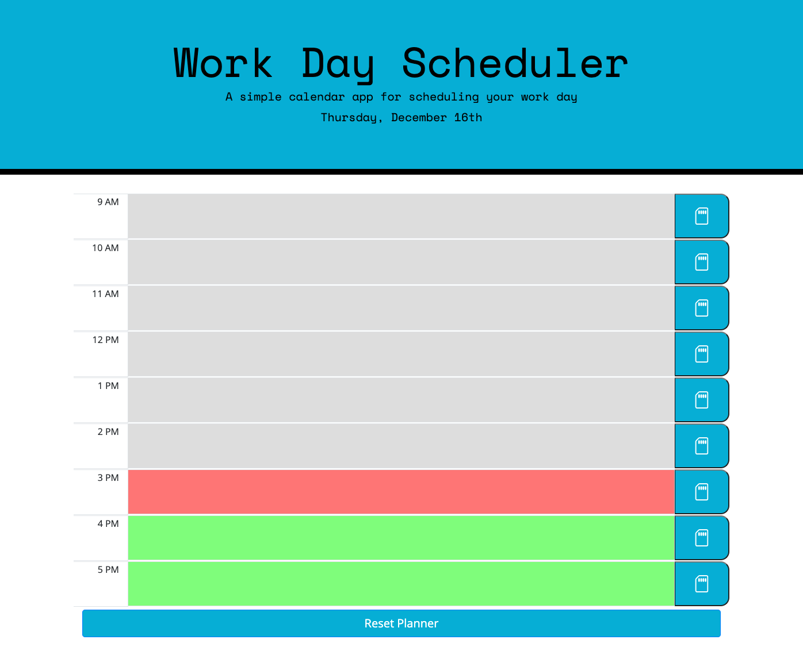

# day-planner

## Description
This is a basic day planner to schedule a normal 9-5 workday created leveraging Moment.js.

## Deployed web visual
Image of website taken at 3:06 PM on December 16th

## Features
The following are the features that were implemented:
* A display of the current date in the banner.
* Dynamically changed text field colors to display what time slots have passed, are currently happening, and are to come.
* 9AM-5PM text boxes that locks editing when input is saved.
* Text inputs are saved in local storage to persist through browser instances.
* Button that clears text fields and storage as well as unlocking the text fields.
* If inputs were done on a previous day, text fields will be cleared for the new day automatically.

## Link
https://andrewbyoo.github.io/day-planner/

## License

